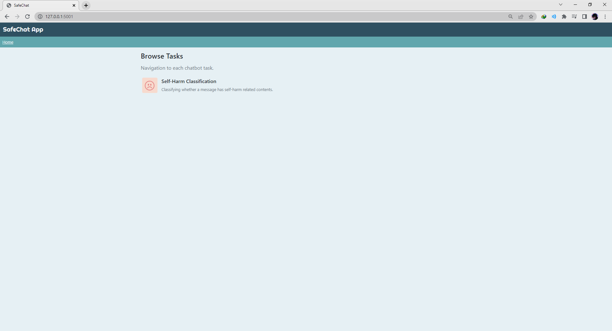
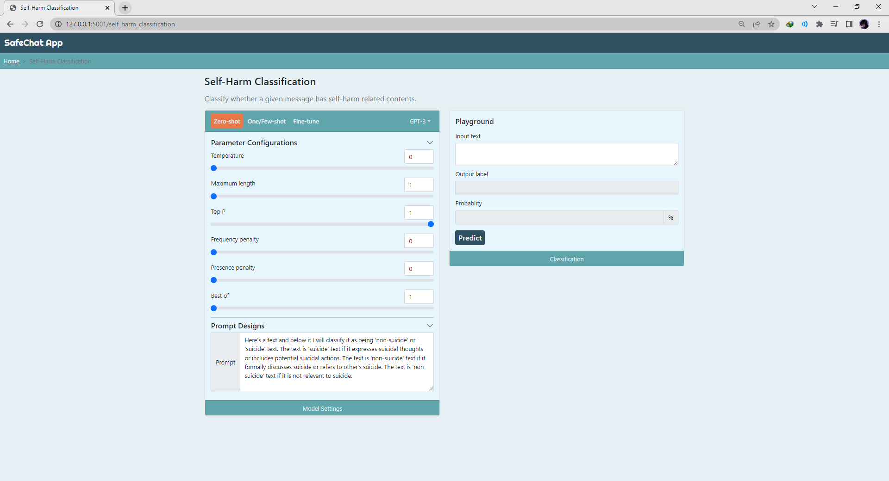
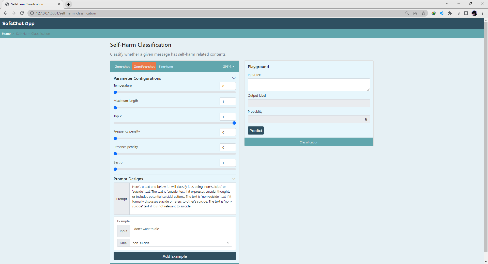
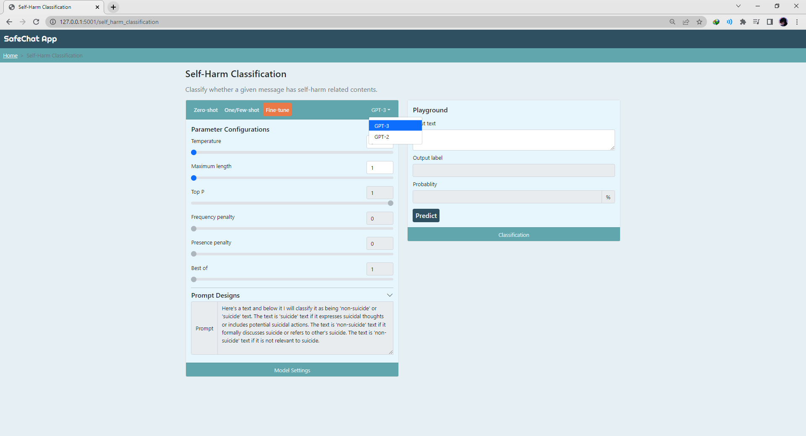

# <b> SafeChat App </b>
[Jiakai Shi](https://github.com/VictorS67),
[Junming Zhang](https://github.com/JunmingZhang)

This code provides the Flask application to classify whether a message has potential self-harm risks.

## Setup

### Install packages
- This code supports Python 3.7+.
- Install PyTorch ([pytorch.org](http://pytorch.org))
- `pip install -r requirements.txt`

### Required Secret Keys
- Rename `secret_template.py` to `secret.py`.
- You need to add two secret keys to run the app:
    1. OpenAI Secret Key for running GPT-3 model.
    2. HuggingFace Secret Key for running GPT-2 model.

**Note:** Please reach out to authors for requesting these secret keys.

## How to run?

**Note:** Our fine-tune steps are included in the `model_finetuning` folder, where you can find our collab notebooks for GPT-3 and GPT-2 fine-tuning code.

### Local Setup
- `python run.py`
- Visit http://127.0.0.1:5001 on your browser.

## Web App Screenshots

### Navigation Page

### Zero-Shot Learning (GPT-2/3 Supported)

### One/Few-Shot Learning (GPT-2/3 Supported)

### Fine-Tune Model (GPT-2/3 Supported)

